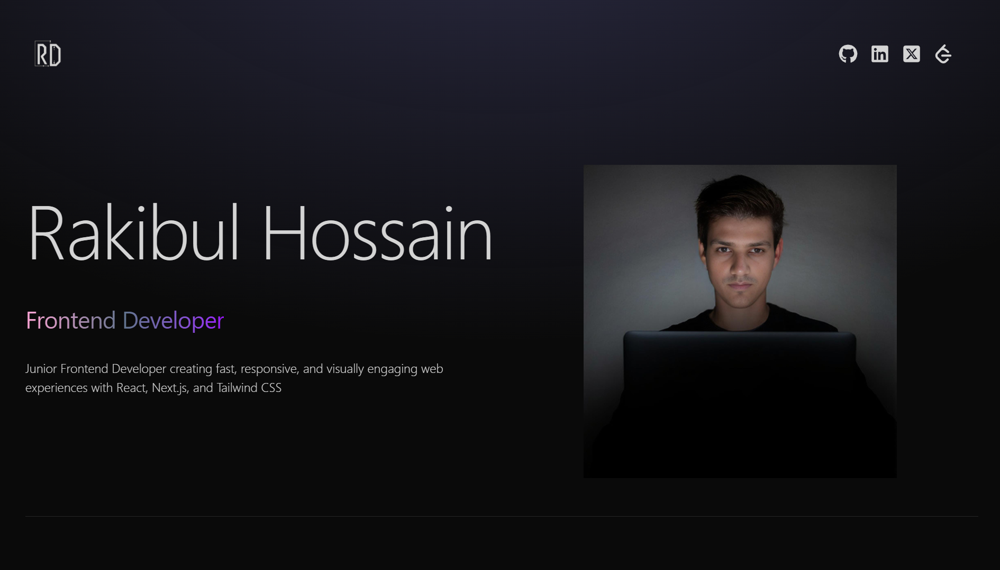

# Rakibul's Portfolio

  


Personal portfolio website showcasing my skills, projects, and contact information as a web developer.

🌐 **Live Demo:** [Rakibul Hossain](https://rakib-dhali-portfolio.vercel.app)

## ✨ Features

- Modern & responsive design
- Smooth animations & interactions

- Sections: Hero, About, Skills, Projects,  Contact
- Fast performance with Vite ⚡
- Clean code structure & component-based architecture

## 🛠️ Tech Stack

- **Frontend Framework**: React (Vite)
- **Styling**: CSS / Tailwind CSS / CSS Modules / Styled-components (whichever you're using — feel free to specify)
- **Build Tool**: Vite
- **Code Quality**: ESLint
- **Deployment**: Vercel

## 📂 Project Structure

```text
rakib-portfolio/
├── public/                 # Static assets
├── src/
│   ├── assets/             # Images, icons, etc.
│   ├── components/         # Page components (Hero, About, etc.)  
│   ├── constants           # project atribute and contact          
│   ├── App.jsx             # Main app component
│   ├── main.jsx            # Entry point
│   └── index.css           # Global styles
├── index.html              # HTML entry point
├── package.json
├── vite.config.js
├── eslint.config.js
└── .gitignore


# Clone the repository
git clone https://github.com/Rakib-dhali/rakib-portfolio.git

# Navigate to project directory
cd rakib-portfolio

# Install dependencies
npm install
# or
yarn install
# or
pnpm install

# Start development server
npm run dev
# or
yarn dev
# or
pnpm dev

npm run build
# or
yarn build
# or
pnpm build

npm run preview